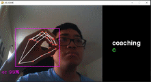

ASL_Game
========

What is this?
-------------

This is like any other spelling game, except you gesture the ASL alphabet to spell each word.

How do you play the game?
-------------------------

See set-up before running the game.

A screen containing your webcam and a word that you have to spell will appear. When you sign a letter, the recognized letter by the trained model will appear in the lower left corner. When that letter is held for ~1.5 seconds, it will be added to your attempted spelling of the word. At the end of the game, your accuracy will then appear!

How does the game recognize each signed letter?
-----------------------------------------------

Supervised learning on a machine-learing model was used to predict what letter is signed based on the positions of each digit in a hand. The [mediapipe](https://google.github.io/mediapipe/solutions/hands.html) libary aided in getting these positions. However, since these give pixel coordinates relative to the window, I converted these coordinates into ones relative to the wrist so that the position of the hand on the screen has no effect. I then created ~170 examples for each letter (except gestures such as j and z) to train* the model.

**The Tensorflow library was used for training. [Link to the Google Notebook for training code.](https://colab.research.google.com/drive/1Bd5zsfpQbhnjug0rNdNSJ5D6Nzfz67fc)*

Set-up
------

First, clone this repo:

```git clone https://github.com/kylerod22/ASL_Game.git```

Then, install these libraries via pip:

```pip install mediapipe opencv-contrib-python pygame numpy tensorflow```

There is also a config file you can edit (```config.properties```) to change the settings of the game:
- ```CamId```: If your webcam is the only camera connected to your computer, set this to 0. Otherwise, keep on modifying it until the id represents your webcam.
- ```CamInverted```: Some webcams may be inverted (i.e. moving your hand left may be shown as moving right on the camera), so change this accordingly so that your camera essentially acts as a mirror
- ```MaxWords```: Set this to however many words you wish to be tested on before the game ends.

Finally, run ```game.py```

At the moment, this game only recognizes right-hand signed letters. I will implement left-hand signs soon.

Demo
----

